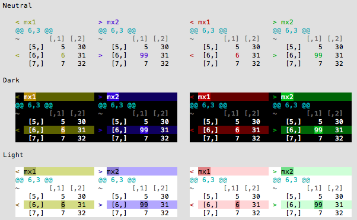

# diffobj - Diffs for R Objects

<a href='https://travis-ci.org/brodieG/diffobj'></a>
<a href='https://codecov.io/github/brodieG/diffobj?branch=master'>
  
</a>

Generate a colorized diff of two R objects for an intuitive visualization of their differences.

See [vignette](http://htmlpreview.github.io/?https://raw.githubusercontent.com/brodieG/diffobj/master/inst/doc/diffobj.html) for details.

## Output

If your terminal supports formatting through ANSI escape sequences, `diffobj` will output colored diffs to the terminal.  Here are some examples of available color schemes from a 256 color terminal:



If ANSI support is not detected, output will be colored with HTML/CSS and sent to the IDE viewport if available or to your browser otherwise.

## Installation

Currently this package is only available on Github:

```
devtools::install_github("brodieG/diffobj")
vignette("diffobj", package="diffobj")
```

## Branch Status

<table style="border: none; background-color: transparent;">
  <tr style="border: none; background-color: transparent; padding: 2px;">
  <th style="text-align: right;">rc:
  <td>
  <a href='https://travis-ci.org/brodieG/diffobj'>
    
  </a>
  <td>
  <a href='https://codecov.io/github/brodieG/diffobj?branch=rc'>
    
  </a>
  <tr style="border: none; background-color: transparent; padding: 2px;">
  <th style="text-align: right;">development:
  <td>
  <a href='https://travis-ci.org/brodieG/diffobj'>
    
  </a>
  <td>
  <a href='https://codecov.io/github/brodieG/diffobj?branch=development'>
    
  </a>
</table>
